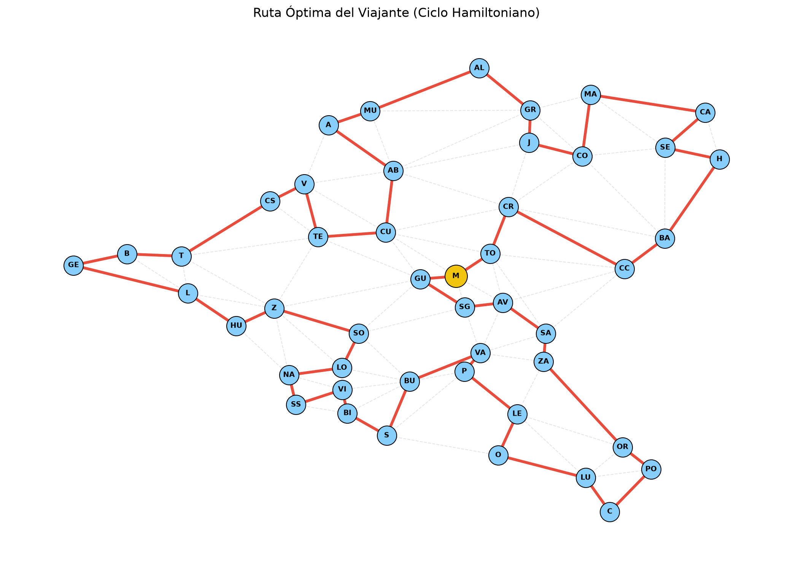
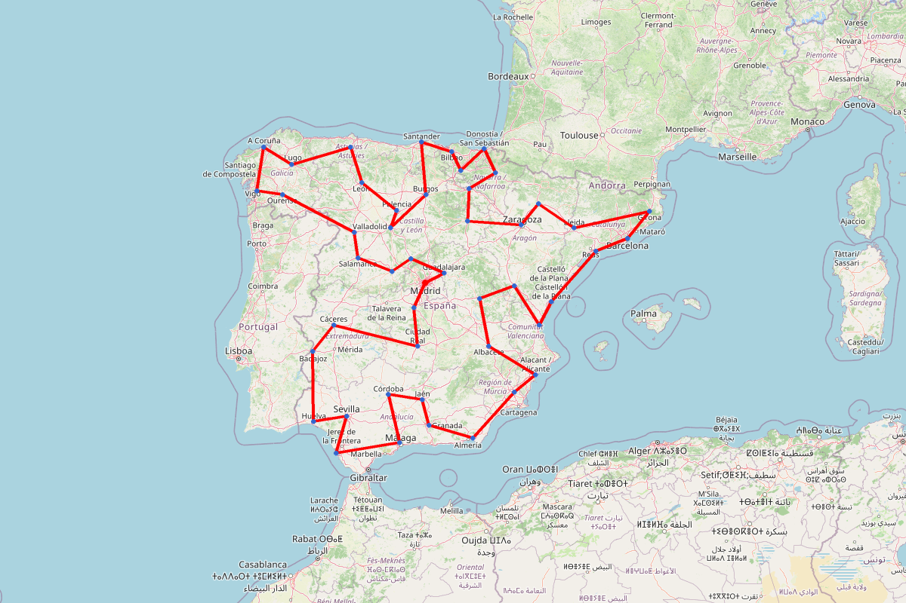

# Problema del Viajante: Ruta por España

Este proyecto resuelve el clásico **Problema del Viajante (TSP - Travelling
Salesperson Problem)** aplicado a una red de ciudades (capitales de provincia de
España).

## Teoría

El Problema del Viajante busca encontrar la ruta más corta posible que visite
exactamente una vez cada ciudad y regrese al punto de origen (formando un _Ciclo
Hamiltoniano_).

Dado que el problema es **NP-Hard**, el número de permutaciones crece
factorialmente con el número de ciudades. Para $N=47$ ciudades, el total de
ciclos teóricos en un grafo completo es $\frac{46!}{2} \approx 2.75 \times
10^{57}$.

En este proyecto, hemos modelado el problema de forma exacta utilizando
**Programación Lineal Entera (ILP)** mediante la librería `pulp` de Python.
Utilizamos la formulación **MTZ (Miller-Tucker-Zemlin)** para la eliminación de
subtours:

- $x_{ij} \in \{0, 1\}$ indica si viajamos de la ciudad $i$ a la $j$.
- $u_i$ son variables continuas que determinan el orden de visita para evitar
  subciclos desconectados.

El solver encuentra la ruta exacta matemáticamente óptima utilizando única y
exclusivamente las conexiones reales definidas en `network.txt`.

## Ejecución del Proyecto

El proyecto utiliza `uv` como gestor de dependencias y `just` como orquestador
de tareas.

### Instalar dependencias

```bash
uv sync
```

### Orquestador (recomendado)

```bash
just all        # Ejecuta todo el pipeline completo
just resolver   # Solo el solver TSP
just grafo      # Solo la visualización del grafo
just mapa       # Solo el mapa interactivo
just estatico   # Solo el mapa estático
just conectar   # Solo el análisis de conectividad
just rutas      # Solo el cálculo teórico de rutas
just clean      # Limpiar archivos generados
```

### Ejecución manual de scripts

```bash
uv run python solve_tsp.py          # Solver TSP → data/ruta_optima.json
uv run python draw_route.py         # Grafo estático → ruta_optima.png
uv run python draw_map.py           # Mapa interactivo → mapa_ruta.html + data/coordenadas_centro.json
uv run python draw_static_map.py    # Mapa estático → mapa_ruta_estatico.png
uv run python connectivity.py       # Conectividad → data/conectividad.json
uv run python tsp_routes_count.py   # Cálculo teórico de rutas
```

### Flujo de datos

```
network.txt ──────────────────────────────────────────────────────────────┐
                                                                          │
data/ciudades.tsv (códigos de ciudad → nombres)                           │
                                                                          │
     solve_tsp.py                 → data/ruta_optima.json                 │
     draw_route.py   + ruta.json  → ruta_optima.png                       │
     draw_map.py     + ruta.json  → mapa_ruta.html + data/coordenadas_centro.json│
     draw_static_map.py           → mapa_ruta_estatico.png                │
     connectivity.py              → data/conectividad.json                │
     tsp_routes_count.py          → (stdout)                              │
```

---

## Resultados Visuales

A continuación, se muestra el dibujo del ciclo hamiltoniano óptimo (iniciado y
finalizado en Madrid, **M**):



### Mapa de España (Estático)

Debido a restricciones de seguridad en GitHub que impiden incrustar mapas web
interactivos (HTML/JS) directamente en los archivos Markdown, hemos generado
esta previsualización estática de la ruta sobre el mapa de España:



> **Nota para visualización interactiva:** Puedes generar una versión
> completamente **interactiva** de este mapa (con zoom y descripciones)
> ejecutando en tu terminal el comando: `uv run python draw_map.py`. Esto creará
> el archivo `mapa_ruta.html`, que puedes abrir localmente en cualquier
> navegador web.

---

## Análisis de Tiempos de Viaje

Una vez obtenida la ruta óptima, cuya distancia total aproximada es de **6.036,3
kilómetros**, es natural preguntarse cuánto tiempo tomaría completarla en el
mundo real. Asumiendo una velocidad media de 85 km/h (combinando autovías y
carreteras nacionales), esto resulta en unas **71 horas de conducción pura**.

A continuación, analizamos dos escenarios muy distintos para realizar este
recorrido:

### 1. Enfoque Logístico / Conductor Profesional

Si planteamos la ruta como un reto de conducción ininterrumpida o trabajo
logístico, rigiéndonos por la normativa europea (máximo 9 horas de conducción
diarias):

- **Modo "Non-stop":** Tardarías **8 días** completos al volante, deteniéndote
  únicamente para dormir y descansar lo obligatorio.
- **Modo "Reparto":** Si asumes una pequeña parada técnica de 1 hora en cada
  ciudad, el viaje se extiende a **12 o 13 días** de trabajo intenso.

### 2. Enfoque Viaje Turístico (_Road-Trip_)

Nadie quiere pasar 9 horas diarias al volante durante sus vacaciones. Si el
objetivo es disfrutar del patrimonio, la gastronomía y la cultura de las 47
capitales de provincia, los tiempos cambian drásticamente:

- **Turismo "Express" (3 a 4 semanas):** Un ritmo dinámico visitando 2 ciudades
  por día. Esto implica conducir unas 3 horas diarias. El viaje se completaría
  en unos **24 a 28 días**, ideal para aventureros que quieren la "foto" en cada
  ciudad sin profundizar demasiado.
- **Ritmo "Clásico" (Mes y medio):** El ritmo ideal para unas vacaciones
  placenteras. Asignando 2-3 días a las grandes ciudades (Madrid, Barcelona,
  Sevilla, Valencia), 1 día entero a las de gran peso histórico, y medio día a
  las más pequeñas. Tomaría aproximadamente **45 días (6 semanas)**, permitiendo
  visitar museos y descansar correctamente.
- **"Slow Travel" (2 meses o más):** Si decides recorrer la ruta sin prisas,
  deteniéndote también en los pueblos de camino, parques naturales o la costa de
  cada provincia, necesitarías apartar fácilmente **más de 60 días**. ¡El viaje
  de tu vida!
